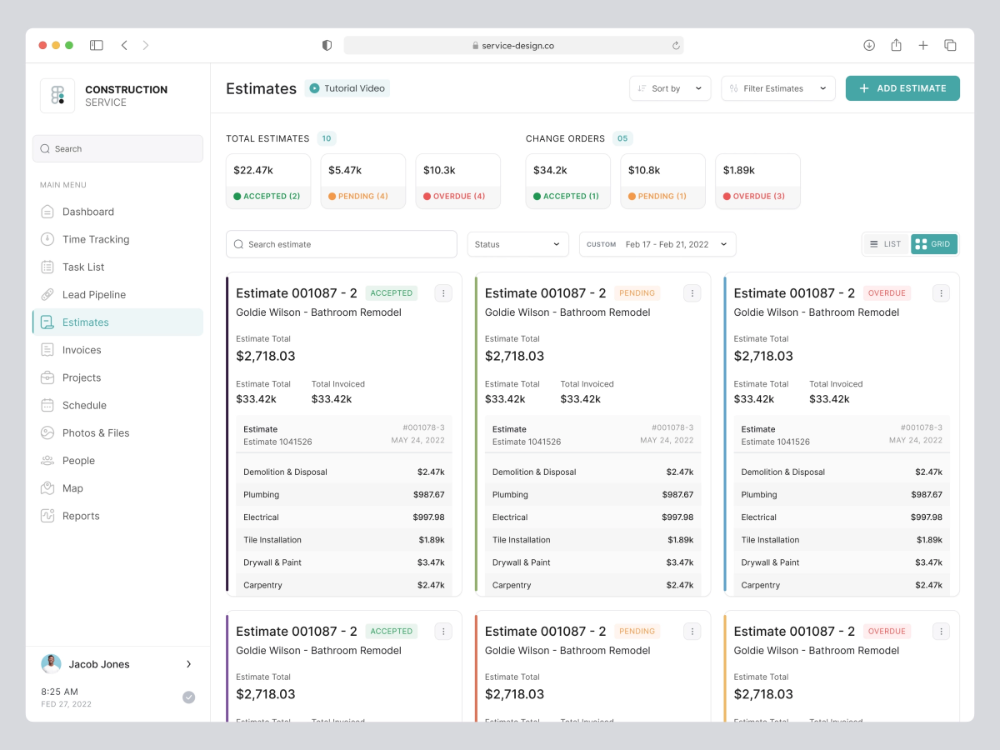
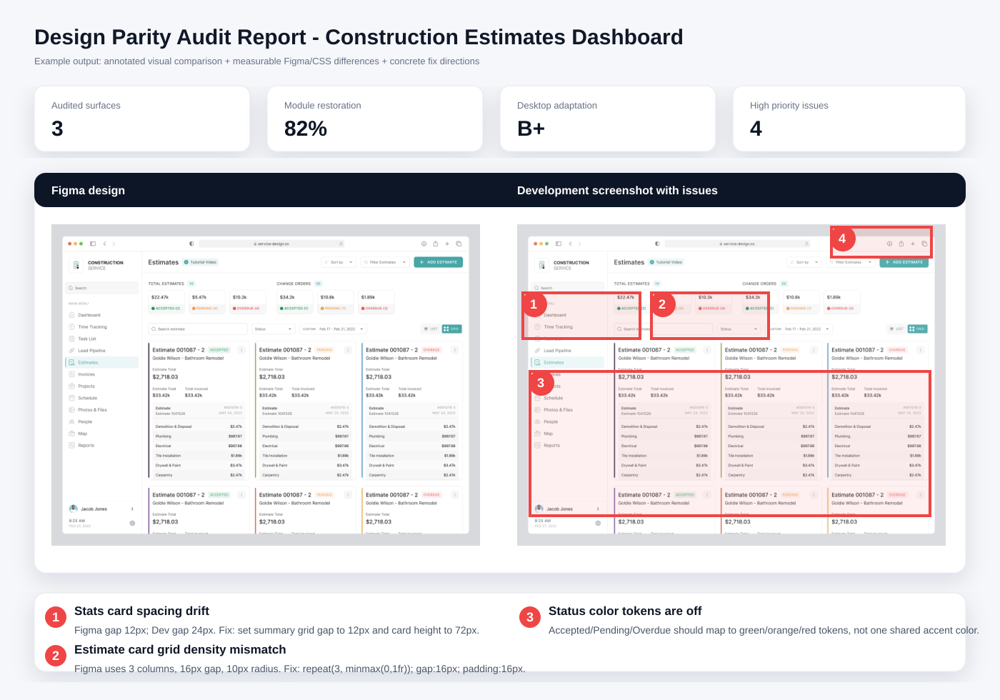

# Design Parity Audit

一个用于 **设计走查 / 还原度走查** 的 Codex Skill。

它适合在你已经有开发页面和 Figma 设计稿时，让 Codex 像设计师一样做模块级对照检查：不仅看截图像不像，还会结合 Figma 参数和页面 CSS 参数，输出可放大查看的可视化走查报告。

## 能做什么

- 对照 Figma 与开发页面，输出模块还原百分比
- 支持一个功能模块下的多页面、Tab、弹窗、抽屉、详情页和创建/编辑流程
- 在开发截图上直接标记问题位置
- 每个问题写清楚 Figma 参数、开发参数和具体怎么改
- 报告支持页面切换、鼠标滚轮缩放、拖拽平移、100% 查看和适配查看
- 默认按 `1440 × 900` 做主还原度评分，并检查 `1280 × 800` 桌面适配
- 自动屏蔽演示数据、真实数据文本差异、头像姓名、水印、浏览器浮层、Figma 占位图等噪音

## 安装

在 Codex 中直接说：

```text
安装 https://github.com/fox0373/design-parity-audit/tree/main/design-parity-audit
```

或者使用命令安装：

```bash
python3 ~/.codex/skills/.system/skill-installer/scripts/install-skill-from-github.py --repo fox0373/design-parity-audit --path design-parity-audit
```

安装后重启 Codex，让新 skill 生效。

## 使用案例

你可以这样把开发地址、Figma 地址和模块范围发给 Codex：

```text
用 design-parity-audit 做一下这个功能模块的设计走查：

开发地址：https://example.com/admin/trainui/exam/examination
Figma：https://www.figma.com/design/xxxx/应用?node-id=1095-18149&m=dev
模块范围：考试管理
```


### 案例：Construction Estimates Dashboard

下面这个示例用一张后台 Dashboard 设计稿演示这个 skill 适合怎样的走查场景。



示例走查结果会像这样：左侧是设计稿，右侧是开发稿，问题直接标在开发稿上，下方给出还原度和具体修改建议。



你可以把需求写成这样：

```text
用 design-parity-audit 做一下这个功能模块的设计走查：

开发地址：https://demo.example.com/construction/estimates
Figma：https://www.figma.com/design/demo/construction-service?node-id=100-200&m=dev
模块范围：Construction Estimates Dashboard
```

这个案例会重点检查：

| 区域 | 走查重点 | 示例问题 |
| --- | --- | --- |
| 左侧导航 | Logo、菜单层级、选中态、搜索框、用户信息区 | 侧栏宽度偏窄、选中态颜色不一致 |
| 顶部工具栏 | 标题、Tutorial Video、排序、筛选、Add Estimate 按钮 | 按钮高度、圆角、主色和右边距偏差 |
| 数据概览卡片 | Total Estimates / Change Orders 的卡片尺寸、间距、状态颜色 | 卡片间距过大、状态标签颜色不准 |
| 搜索和筛选区 | Search estimate、Status、Date Range、List/Grid 切换 | 控件高度不一致、筛选组没有对齐 |
| Estimate 卡片列表 | 三列栅格、卡片边框色、状态标签、金额字号、条目行高 | 卡片宽度不均、内容密度过松、状态色错误 |

报告里的问题会写成这种形式：

```text
问题 3：Estimate 卡片栅格和卡片密度偏差

Figma：内容区为 3 列卡片栅格，卡片间距约 16px，卡片圆角约 10px，
Accepted / Pending / Overdue 使用不同左侧状态色。

开发：卡片列宽被拉伸到 360px 以上，卡片内金额字号偏小，列表行高偏松，
状态色只用了单一蓝绿色。

怎么改：内容容器使用 grid-template-columns: repeat(3, minmax(0, 1fr))；
列间距设为 16px；卡片 padding 设为 16px；金额字号设为 18px/24px；
状态色分别映射 accepted=#1EA672、pending=#F5A623、overdue=#F05252。
```

Codex 会执行这些步骤：

1. 打开开发页面，确认不是登录页或错误页
2. 从 Figma MCP 读取设计稿截图、节点尺寸、间距、字号、颜色等参数
3. 点击开发页面里的子页面、状态 Tab、详情、弹窗或抽屉
4. 为每个页面或状态生成一组 Figma / 开发对照图
5. 在开发截图上用编号标记差异
6. 输出一个 HTML 走查报告，包含还原度、问题数量、适配健康度和具体修改建议

## 输出报告长什么样

报告会优先输出可视化 HTML，通常包含：

- 顶部概览：走查页面数量、模块还原程度、桌面适配健康度、高优先级问题数量
- 页面 Tab：一个 Tab 对应一个被走查的页面或状态
- 对比稿：左侧 Figma，右侧开发稿，问题直接标在开发稿上
- 问题说明：每条问题都包含“Figma 参数 / 开发参数 / 怎么改”
- 查看能力：滚轮缩放、拖拽平移、适配窗口、100% 查看

## 适合场景

- 设计师验收开发还原度
- 产品/研发自查页面是否偏离设计稿
- 复杂后台模块上线前走查
- 多页面业务流程、表格、筛选区、弹窗、抽屉、详情页的视觉一致性检查

## 当前默认规则

- 主走查尺寸：`1440 × 900`
- 桌面适配尺寸：`1280 × 800`
- 不做手机和平板，除非你明确要求
- 不把真实业务数据和 Figma 示例数据的文本差异当成设计问题
- 不把合理自适应宽度变化直接判错，只标记由宽度变化造成的结构、密度、溢出和对齐问题

## Skill 目录

真正的 Codex Skill 在：

```text
design-parity-audit/
  SKILL.md
  agents/openai.yaml
```
